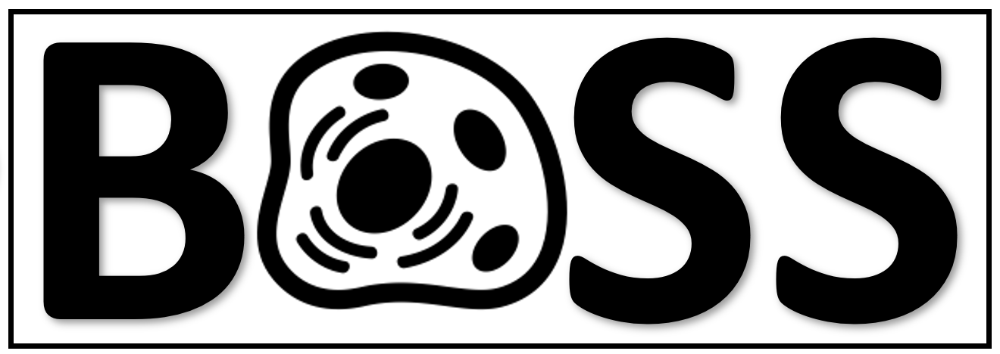

<!-- README.md is generated from README.Rmd. Please edit that file -->

# bossR 

<!-- badges: start -->
<!-- badges: end -->

The `bossR` package segments and tracks the cells from the BOSS method.
Access to the full papers can be found
[here](https://www.biorxiv.org/content/10.1101/2022.06.17.495689v1).
Additionally, it allows for visualization of the segmented/tracked cells
overlayed in original image.

## Installation

You can install the development version of bossR like so:

``` r
devtools::install_github('calebae/bossR')
```

## Vignette

For a full implementation of the methods with output please see our
[vignette]().

``` r
library(bossR)
## basic example code
```
